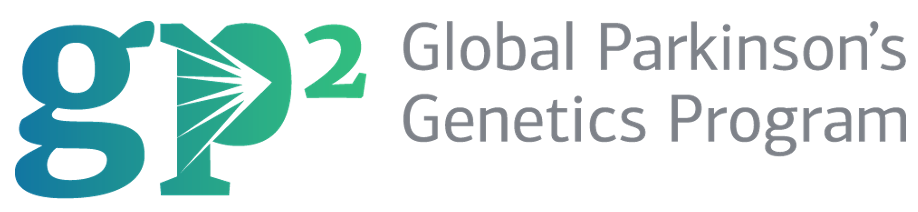

<a name="readme-top"></a>

<!-- PROJECT SHIELDS -->
<!--
*** I'm using markdown "reference style" links for readability.
*** Reference links are enclosed in brackets [ ] instead of parentheses ( ).
*** See the bottom of this document for the declaration of the reference variables
*** for contributors-url, forks-url, etc. This is an optional, concise syntax you may use.
*** https://www.markdownguide.org/basic-syntax/#reference-style-links
-->

<!-- PROJECT LOGO -->
<br />
<div align="center">
  <a href="https://github.com/AMCalejandro/gp2-manifest-checkupload/tree/main/">
    
  </a>

  <h3 align="center">GP2 CIWG data QC - Upload - Visualise app</h3>

  <p align="center">
    An app that allows you to QC your data, then upload it to GP2 system. You will also be able to visualise your data
    <br />
    <br />
  </p>
</div>


<!-- TABLE OF CONTENTS -->
<details>
  <summary>Table of Contents</summary>
  <ol>
    <li>
      <a href="#about-the-app">About the app</a>
      <ul>
        <li><a href="#built-with">Built With</a></li>
      </ul>
    </li>
    <li>
      <a href="#getting-started">Getting Started</a>
      <ul>
        <li><a href="#prerequisites">Prerequisites</a></li>
        <li><a href="#installation">Installation</a></li>
      </ul>
    </li>
    <li><a href="#usage">Usage</a></li>
    <li><a href="#contact">Contact</a></li>
    <li><a href="#acknowledgments">Acknowledgments</a></li>
  </ol>
</details>


<!-- ABOUT THE PROJECT -->
## About the app

Welcome to the GP2 Cohort Integration Working Group app. This is an application intended to make easier the burden of harmonizing the data to GP2 standards. We are currently helpong to harmonise both sample manifest and clinical data through the app. Then, you can upload the data to GP2 managed storage systems and finally visualise the data within the app.

Another cool hint about this app is that it automatically assign GP2 IDs for you, which will speed up the process in both sides, getting closer to being part of GP2 and controbuting to the initiative.

The intended workflow is as follow:
* Download sample manifest and clinical data templates and fill in.
* Once sample manifest has been filled in, upload to the app ( sample manifest tab), download the QCed sample manifest, and download it.
* Review the sample manifest looks good, and upload it to the GP2 storagte system (Upload tab)
* Complete the clinical data template and upload it to the app ( clinical tab)
* Download the QC clinical data, and upload to the GP2 storage system ( Upload tab)
* Move to the visualization tab and have fun looking at your data using different type of plots and applying different filters

<p align="right">(<a href="#readme-top">back to top</a>)</p>


### Built With

Here I summarise the main software we have used to build the app

 


<p align="right">(<a href="#readme-top">back to top</a>)</p>


<!-- GETTING STARTED -->
## Getting Started

Here, I summarise some points to efficiently use the app.
* To perform clinical data QC and then visualise, please make sure you QC and upload the sample manifest for your samples
* If your are QC ing several sample manifests at a time, please refresh the app between sample manifests. The  app makes use of something called streamlit session state to propagate data across apps, you need to release the cache between sample manifests first.
* You can only visualise your data if both the sample manifest and the clinical data have been QCed. Otherwise an error message will pop up


### Prerequisites

* Docker installed
* Python3.8 or higher
* Access to the GCP project in which the app is hosted


### Installation 

If you wanted to run this app locally and play with it, it should be ass simple as:

1. Clone the github repository

```bash
git clone git@github.com:AMCalejandro/gp2-manifest-checkupload.git
```

2. Make sure you have access to some paths hard coded within the app not added on the github remote

3. Build the docker container that contains the app

```bash
docker build -t <docker-container-name> .
```

4. Run the docker container on a port

```bash
docker run -d -p 8080:8080 <docker-container-name>
```

5. Alternatively, you can also build virtual environment, then run the streamlit app locally

```bash
streamlit run app.py

```


<p align="right">(<a href="#readme-top">back to top</a>)</p>


<!-- USAGE EXAMPLES -->
## Usage

Use the navigation bar at the top of the app to move around the tabs available on the app. 

Once you upload the data to either the sample manifest or the clinical data tabs, you should be able to follow along and understand how the app is intended to help you harmonising your data to GP2 standards.

Same way, you should be able to easily upload your data the storage system and the visualization tabs and follow along.


<p align="right">(<a href="#readme-top">back to top</a>)</p>


<!-- CONTRIBUTING -->
## Contributing

Contributions are what make the open source community such an amazing place to learn, inspire, and create. Any contributions you make are **greatly appreciated**.

If you have a suggestion that would make this better, please fork the repo and create a pull request.
Thanks again!

1. Fork the Project
2. Create your Feature Branch (`git checkout -b feature/AmazingFeature`)
3. Commit your Changes (`git commit -m 'Add some AmazingFeature'`)
4. Push to the Branch (`git push origin feature/AmazingFeature`)
5. Open a Pull Request

<p align="right">(<a href="#readme-top">back to top</a>)</p>


<!-- LICENSE -->
## License

Distributed under the MIT License. See `LICENSE.txt` for more information.

<p align="right">(<a href="#readme-top">back to top</a>)</p>


<!-- CONTACT -->
## Contact

Alejadro - [![LinkedIn][linkedin-shield]][linkedin-url]

Project Link: [https://gp2.org/](https://gp2.org/)

<p align="right">(<a href="#readme-top">back to top</a>)</p>


<!-- ACKNOWLEDGMENTS -->
## Acknowledgments

This would not be possible without GP2 support/funding and the help of the Data Tecnica team, specially Hirotaka Iwaki. 
* [DtI](https://www.datatecnica.com/)
* [GP2](https://gp2.org/)

<p align="right">(<a href="#readme-top">back to top</a>)</p>


<!-- MARKDOWN LINKS & IMAGES -->
<!-- https://www.markdownguide.org/basic-syntax/#reference-style-links -->
[product-screenshot]: https://drive.google.com/file/d/1QuqhPFw0YurhFm7O30EthhvXrF8EfX9L/view?usp=drive_link
[st-url]: https://streamlit.io/
[docker-url]: https://www.docker.com/
[gcp-url]: (https://img.shields.io/badge/GoogleCloud-%234285F4.svg?style=for-the-badge&logo=google-cloud&logoColor=white)
[linkedin-url]: https://linkedin.com/in/alejandro-martinez-ba484818a